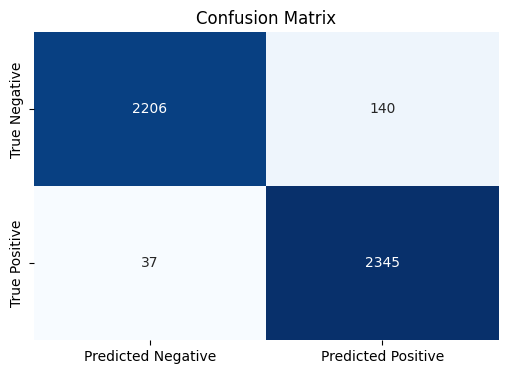
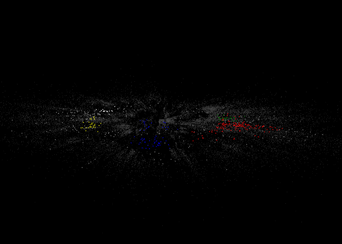

# Research Study on Identifying Massive Stars Using ML/DL Models

## 1. Study Objectives

* Data Analysis & Exploration: Investigate low-resolution XP sampled spectra from Gaia DR3.
* Representation Techniques: Explore methods for processing 1D spectral data.
* Model Performance: Evaluate machine learning (ML) and deep learning (DL) models for identifying massive stars.

## 2. Future Directions

* Develop a comprehensive methodology for identifying massive stars across different surveys, data products, and identification techniques.
* Investigate model capabilities in detecting complex organic molecules (COMs) in high-resolution spectra.

## 3. Related Work

* Physics-Informed Neural Networks (PINNs): Study their potential for generating synthetic spectra to reduce reliance on older codes and enable modular computing approaches.

## 4. Models Included in the Study

| S.no. | Model                        | Architecture Details            | Parameters | References |
|------|------------------------------|--------------------------------|------------|------------|
| 1.    | CNN                          | Convolutional Layers + FC Layers | 175, 841 | [LeCun, Y.; Boser, B.; Denker, J. S.; Henderson, D.; Howard, R. E.; Hubbard, W.; Jackel, L. D. (December 1989). "Backpropagation Applied to Handwritten Zip Code Recognition"](https://ieeexplore.ieee.org/document/6795724) |
| 2.    | 2D-CNN                       | 2D Convolutions for spectral/spatial data | 70, 593 | - |
| 3.    | CNN with attention           | CNN + Attention Mechanism      | 710, 522 | [Elbayad, Maha, Laurent Besacier, and Jakob Verbeek. "Pervasive attention: 2D convolutional neural networks for sequence-to-sequence prediction." CoNLL 2018-Conference on Computational Natural Language Learning. ACL, 2018.](https://inria.hal.science/hal-01851612/) |
| 4.    | CNN-GRU                      | CNN + GRU for sequence modeling | 93, 473 | [Cao, Bo, et al. "Network intrusion detection model based on CNN and GRU." Applied Sciences 12.9 (2022): 4184.](https://www.mdpi.com/2076-3417/12/9/4184) |
| 5.    | CNN-LSTM                     | CNN + LSTM for temporal dependencies | 128, 673 | [Yin, Xiaochun, et al. "A Novel CNN-based Bi-LSTM parallel model with attention mechanism for human activity recognition with noisy data." Scientific Reports 12.1 (2022): 7878.](https://www.nature.com/articles/s41598-022-11880-8) |
| 6.    | Deep ANN                     | Multi-layered Feedforward Network | 354, 320 | - |
| 7.    | Wide ANN                     | Wide Feedforward Network       | 1, 036 | - |
| 8.    | Fully Convolutional Network  | CNN with dense connections     | 5, 658, 881 | [Long, Jonathan, Evan Shelhamer, and Trevor Darrell. "Fully convolutional networks for semantic segmentation." Proceedings of the IEEE conference on computer vision and pattern recognition. 2015.](https://ieeexplore.ieee.org/abstract/document/7478072) |
| 9.    | StarNet                      | Another custom model           | 181, 793 | [Fabbro, S., et al. "An application of deep learning in the analysis of stellar spectra." Monthly Notices of the Royal Astronomical Society 475.3 (2018): 2978-2993.](https://academic.oup.com/mnras/article/475/3/2978/4775133) |
| 10.   | StellarNet                   | Variant of CNN for stellar spectra | 1, 515, 057 | - |

## 5. Dataset Information

### Gaia DR3 XP Sampled Dataset

* Dataset Composition:

  - Combined ALS-II catalog of OB stars with all O/B-classified stars from Gaia DR3.
  - Additional low-mass stars included to balance dataset.
  - Final dataset: ~22,000 sources.
  - XP sampled spectra available for ~19,000 stars.

* Category Distribution:

  * Training:
    - Low-mass stars: 9,381 objects
    - Massive stars: 9,527 objects
    - Balanced Dataset: Ensures models generalize without category bias
  * Testing
    -  Low-mass stars: 2,346 objects
    - Massive stars: 2,328 objects

## Results

### 6. Model performances across Gaia DR3 dataset

* Training Setup:
  - Stratified K-Fold (n=10) training.
  - 50 epochs with early stopping.
  - Binary Cross-Entropy (BCE) loss function used for evaluation

| S.no. | Model                | Training Loss | Validation Loss | Validation Accuracy |
|-------|----------------------|--------------|----------------|---------------------|
| 1.    | CNN                  | 0.31         | 0.37           | 0.9375              |
| 2.    | 2D-CNN               | 0.09         | 0.10           | 0.9694              |
| 3.    | CNN with attention   | 0.10         | 0.11           | 0.9682              |
| 4.    | CNN-GRU              | 0.11         | 0.12           | 0.9655              |
| 5.    | CNN-LSTM             | 0.19         | 0.19           | 0.9449              |
| 6.    | Deep ANN             | 0.16         | 0.22           | 0.9352              |
| 7.    | Wide ANN             | 0.24         | 0.24           | 0.9232              |
| 8.    | Fully Connected CNN  | 0.09         | 0.12           | 0.9602              |
| 9.    | StarNet              | 0.12         | 0.16           | 0.9494              |
| 10.   | StellarNet           | 0.08         | 0.12           | 0.9615              |

## 7. Visualizations & Predictions  

### 7.1 Predictions on Testing Data  

The model was evaluated on the testing dataset, yielding the following performance metrics:  

- **Accuracy**: 0.9626  
- **F1 Score**: 0.9636  
- **AUC Score**: 0.9864  

#### Confusion Matrix  
The confusion matrix illustrates the model’s classification performance:  

  

---

### 7.2 Predictions on Unseen Data  

To assess model generalization, predictions were made on **1 million randomly sampled stellar objects** from **Gaia DR3**. The resulting class distribution is:  

- **Low-mass stars**: **1,193,196**  
- **High-mass stars**: **11,297** (~1% of the total sample), aligning with current population estimates.  

#### Scatter Plot of Predictions  
The visualization below illustrates the spatial distribution of predicted massive stars:  

  

---

### 7.3 Clustering Analysis with DBSCAN  

A **DBSCAN** clustering algorithm was applied to the predicted high-mass stars, identifying potential associations and spatial structures within the dataset:  

  